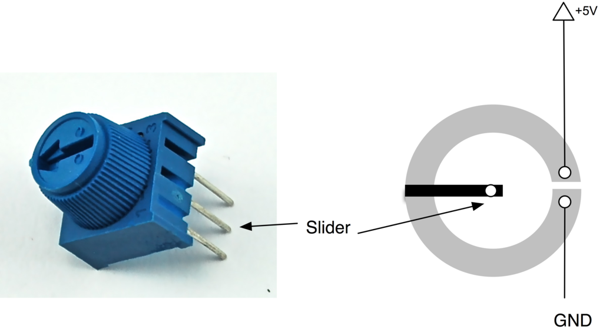

# Control 7 segment display with a potentiometer

This project uses a potentiometer to control a seven segment display. Using an Arduino Uno as the communication interface between the two peripherals, the potentiometer would display a single number from 0-9 on the seven segment display.

## List of components
1. Arduino Uno
2. Rotary potentiometer
3. Seven segment display (5611AS - common cathode)
4. 220 kΩ resistor

## Potentiometer pins

The pin configuration of the potentiometer is:
1. 5V
2. slider pin
3. ground

## Seven segment display pin configuration
According to the datasheet, the seven segments of the display are labelled as pins A-G and DP show in the below image

These segments are mapped onto the external pins of the display as shown below

## Connection Diagram

As can be seen in the above connection diagram, the driving pin of the potentiometer is connected to A0 in the Arduino. This is an analog input pin that reads the output from the potentiometer into a number in the range of 0-1024. This number is then scaled down to a number in the range between 0 and 9, which is then used to control the seven segment display. A current limiting resistor is also added between the common cathode terminals and ground of the seven segment display to prevent the LEDs from burning out.

## Electrical Schematic
